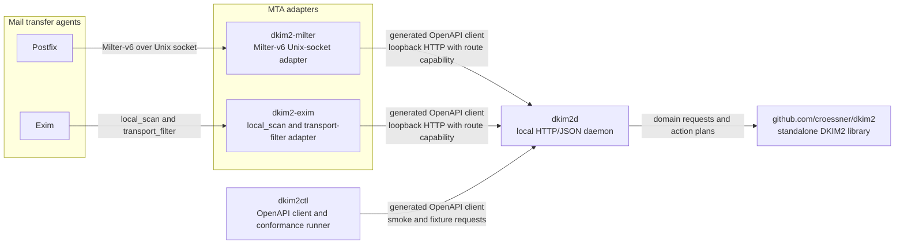

# DKIM2 Reference Implementation

This repository contains an actively developed Go reference implementation of
DKIM2 based on `draft-ietf-dkim-dkim2-spec-06`. The tested DNS behavior
baseline remains `draft-chuang-dkim2-dns-04`; the IETF replaced that document
with `draft-ietf-dkim-dkim2-dns-00` on 2026-07-20 without changing its
normative body. Moving durable identifiers and versioned vectors to the working
group name is a separate reviewed baseline update, not an implicit behavior
change.

The first design goal is precision: the core implementation must work from a
controlled RFC 5322 message representation, preserve wire-significant details,
and keep adapter behavior separate from the protocol engine.

## Repository Status

`github.com/croessner/dkim2` is the canonical development, issue, release, and
Go module repository. `github.com/go-dkim2/dkim2` is a public read-only mirror
for project discovery; it is not an alternative Go module path. Contributions,
issues, and security reports belong in the canonical repository.

The implementation tracks active Internet-Drafts and is therefore experimental.
Published `v0.x` releases provide reproducible interoperability and deployment
evidence, but do not claim final-RFC stability.

## Architecture



The arrows show the runtime request flow. `dkim2-milter` and `dkim2-exim` are
transport adapters: they collect MTA-specific message and envelope evidence,
call `dkim2d`, validate its response, and apply only the admitted action plan.
`dkim2ctl` uses the same local OpenAPI boundary for smoke and conformance
workflows. `dkim2d` is the service layer around the standalone library, which
owns DKIM2 protocol semantics.

Current contents:

- `docs/ARCHITECTURE.md`: current architecture, ownership boundaries, and
  implementation plan.
- `AGENTS.md` and `POLICY.md`: repository development rules and engineering
  policy.
- `Makefile` and `.golangci.yml`: repository-wide local guardrails.
- `docs/ci.md`: GitHub Actions lanes, privilege boundaries, and release gates.
- `go.work`: local development workspace.
- `lib`: standalone DKIM2 library module at
  `github.com/croessner/dkim2`.
- `cmd/dkim2d`: standalone HTTP/JSON daemon module.
- `cmd/dkim2-milter`: standalone Milter adapter module.
- `cmd/dkim2-exim`: source-linked Exim `local_scan()` and transport-filter
  adapter module.
- `cmd/dkim2ctl`: standalone OpenAPI-backed client and test-client module.
- `lib/internal/*`: implemented raw-message, parser, canonicalization,
  verification, policy, recipe, signing, revision, route-authority,
  restricted-release, and datasource protocol foundations.
- `lib/internal/datasource`: storage-neutral exact profile and administrative
  policy contracts with immutable in-memory and confined flat-file providers.
- `lib/internal/datasource/signingprofile`: the sole bridge from validated
  datasource results and opaque key-handle bindings to signing profiles.
- `docs/datasource-ldap-sql-design.md`: storage-neutral LDAP, PostgreSQL,
  MySQL, and MariaDB
  mapping, consistency, resource, and privacy contract.
- `docs/operator/datasource-backends.md`: canonical flat-file, LDAP,
  PostgreSQL, MySQL, and MariaDB installation, configuration, lifecycle,
  monitoring, backup, and troubleshooting guide.
- `docs/operator/ldap-schema-reference.md`: operator-facing LDAP tree,
  object-class, attribute, ACL, publication, and legacy-isolation reference.
- `docs/operator/datasource-key-rotation.md`: DNS overlap, higher-generation
  activation, retirement, and rollback runbook.
- `docs/operator/opendkim-migration.md`: protected dry-run, apply, publication,
  and higher-generation rollback workflow.
- `docs/replay-store-valkey.md`: production replay-store topology, ACL,
  persistence, replication, rotation, integration, and dependency guidance.
- `docs/conformance.md`: public evidence classes, tested capability boundaries,
  adapter limitations, reproducible report commands, and the separate real
  Exim qualification boundary.
- `docs/security-testing.md`: closed fuzz/resource inventories, abuse-profile
  commands, deterministic evidence, privacy limits, and vulnerability policy.
- `docs/reference/README.md`: public API, compatibility, issue, external
  evidence, and known-limitation navigation for the preview candidate.
- `docs/operator/postfix-compose.md`: hardened no-host-exposure-by-default
  Postfix/Milter deployment, lifecycle, backup, and rollback guide.
- `docs/operator/container-supply-chain.md`: reproducible product images,
  multi-architecture layouts, SBOM, provenance, and vulnerability policy.
- `docs/specs/openapi`: authoritative source-of-truth OpenAPI contract.
- `lib/testdata/vectors`: draft-versioned verification, DNS, custody, crypto,
  signing, revision, and insertion vectors.
- `lib/internal/*/testdata`: package-owned canonicalization, recipe application
  and generation, parser, fuzz, and regression fixtures.

## Operator Navigation

Start with
[`docs/operator/postfix-compose.md`](docs/operator/postfix-compose.md) for the
implemented hardened Postfix deployment, trust topology, protected state,
configuration, validation, lifecycle, backup, restore, and troubleshooting.
Follow
[`docs/operator/container-supply-chain.md`](docs/operator/container-supply-chain.md)
for image construction, supported platforms, immutable digest selection, SBOM,
provenance, vulnerability, reproducibility, and publication evidence. The
offline native-domain workflow is documented in
[`docs/operator/native-domain-onboarding.md`](docs/operator/native-domain-onboarding.md),
with parser-checked starting documents in
[`docs/operator/examples/dkim2d-domain-admin-ldap.yaml`](docs/operator/examples/dkim2d-domain-admin-ldap.yaml)
and
[`docs/operator/examples/dkim2d-domain-intent.yaml`](docs/operator/examples/dkim2d-domain-intent.yaml).
The
component references are
[`cmd/dkim2d/README.md`](cmd/dkim2d/README.md),
[`cmd/dkim2-milter/README.md`](cmd/dkim2-milter/README.md), and
[`cmd/dkim2ctl/README.md`](cmd/dkim2ctl/README.md); all HTTP request and
response shapes remain authoritative only in
[`docs/specs/openapi/dkim2d.yaml`](docs/specs/openapi/dkim2d.yaml).
The preview's public API, compatibility, issue, and limitation entry point is
[`docs/reference/README.md`](docs/reference/README.md).

The source-linked Exim adapter, packaging validators, operations guide, and
five-row qualification runner are implemented. Its current capability is
`unqualified_draft06`: the historical Draft-04 matrix passed all five supported
rows with 43 cases per row, but that candidate-bound evidence is not relabeled
or imported for Draft-06. Portable and full Draft-06 conformance omit Exim
execution and reject an evidence root until a fresh, separately authorized
five-row Draft-06 run is bound to unchanged candidate bytes. No prebuilt
universal Exim binary or container image is claimed. LDAP, PostgreSQL, MySQL,
and MariaDB datasource providers,
deployable schema artifacts, and the offline legacy OpenDKIM migration are
implemented. They require operator-supplied verified-TLS services and distinct
least-authority principals. Every network runtime accepts one complete
committed native v2 or v3 generation. The offline
`dkim2d datasource domain` CLI implements native onboarding across all four
network backends. Tagged releases and their associated evidence define release
claims; an arbitrary worktree or mirror checkout does not.

## Current Behavior

The public library signs origin messages, hash-unchanged forwarding copies,
recipe-backed revisions, and authorized next-domain transitions. Signing uses
exact outgoing SMTP envelope evidence, authority-issued copy tickets, opaque
private-key handles, deterministic Draft-06 fields, final message reparsing,
custody checks, and cryptographic self-verification. Local-only and
out-of-band outputs remain closed until their exact route-bound release.

Datasource selection is exact and fail closed. Providers return immutable
same-generation profiles and policies with opaque private-key handle IDs; they
never return private keys or signing capabilities. The memory provider is the
static reference implementation. The flat-file provider accepts a strict,
bounded `dkim2-datasource-v1` JSON snapshot through an owned confined directory
descriptor and publishes reloads atomically. Replay detection now has a
storage-neutral library contract, bounded memory and disabled providers, and a
daemon-owned standalone-primary Valkey provider using privacy-preserving keys
and one non-retryable `SET NX PX` operation. The daemon now owns strict typed
configuration, protected-generation loading, the generated process, sign, and
revise OpenAPI boundary, distinct local route-capability authentication,
replay and signing-store wiring, readiness, and bounded Fx lifecycle. LDAP
loads an immutable committed native v2 or v3 generation through verified TLS.
PostgreSQL, MySQL, and MariaDB also load immutable committed native v2 or v3
generations through verified TLS. Every network provider builds a validated
in-memory signer from the same generation and uses no local private manifest.

`dkim2ctl` provides a generated-client-backed loopback smoke check and a
strict draft-versioned fixture runner. It validates every fixture offline
before protected-file or network access, emits deterministic JSON Lines, and
keeps credentials, message and envelope bytes, paths, URLs, response bodies,
and raw errors out of diagnostics.

Useful verification commands:

```text
go test ./lib/...
go test ./cmd/dkim2d/...
go test ./cmd/dkim2-milter/...
go test ./cmd/dkim2ctl/...
make test
make test-valkey
make check-conformance
make conformance
make conformance-postfix
make conformance-all
make check-security
make fuzz-security
make security
make check-images
make check-deployment
make deployment-postfix
make deployment-security
make check-operator-docs
make check-datasource-schema
make check-datasource-postgresql
make check-datasource-mysql
make test-datasource-services
make check-ci
make check-container-release
make check-release
make guardrails
make release-guardrails
```
