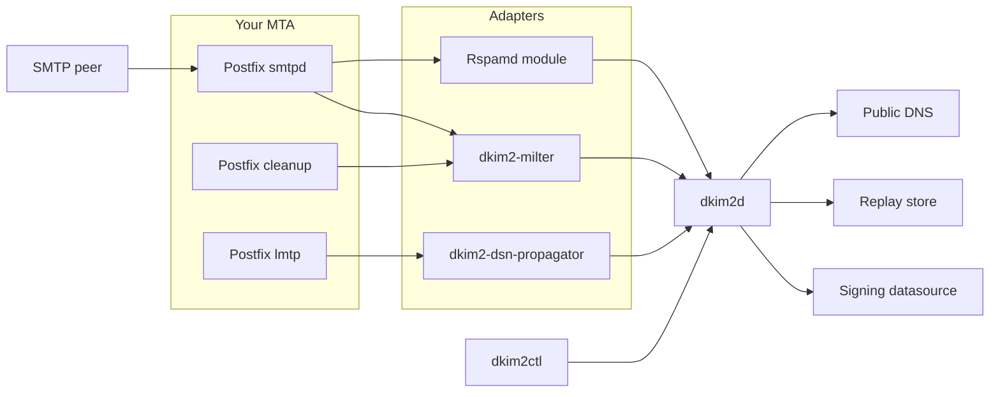
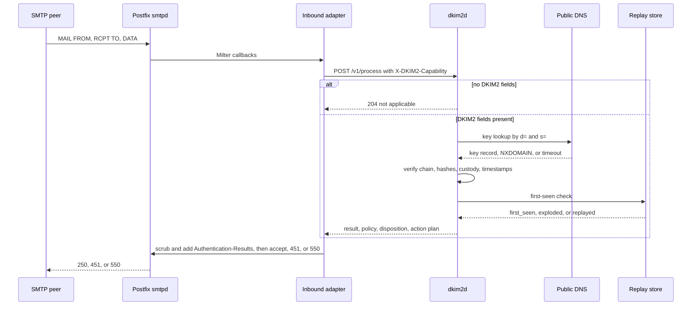
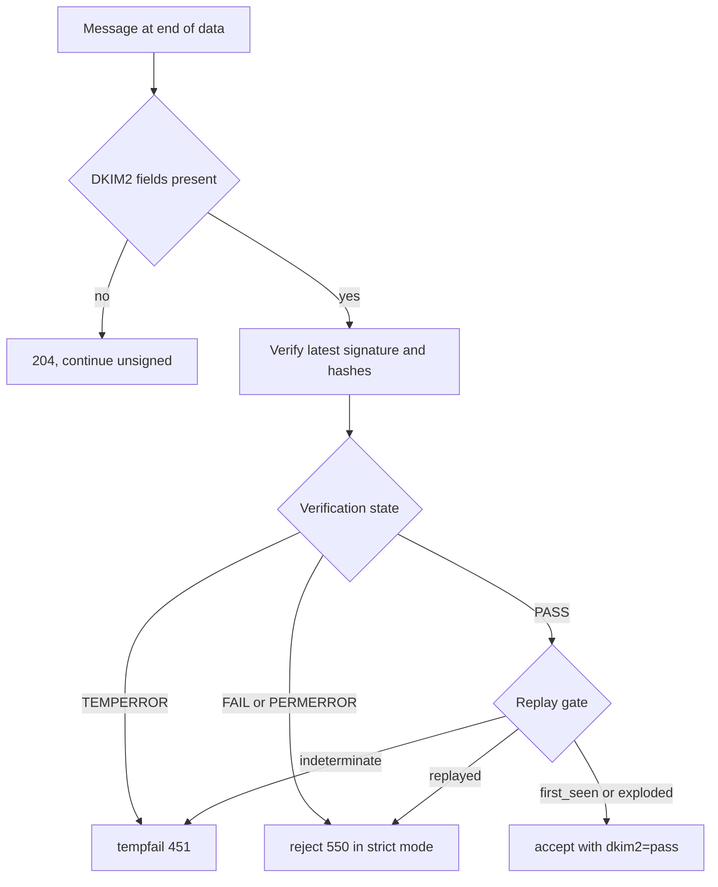
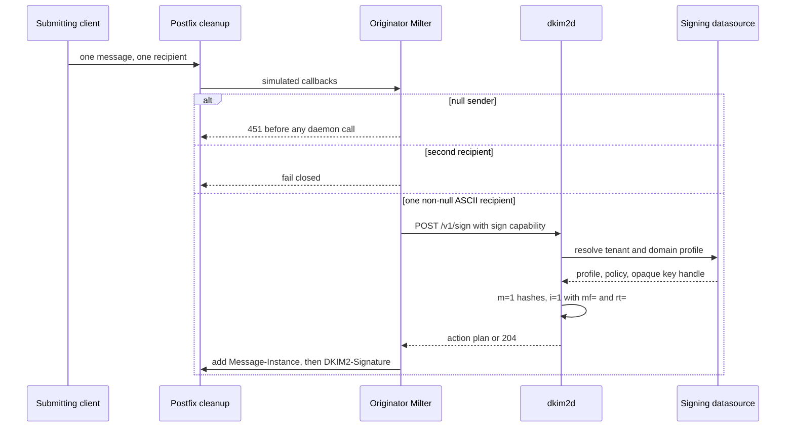
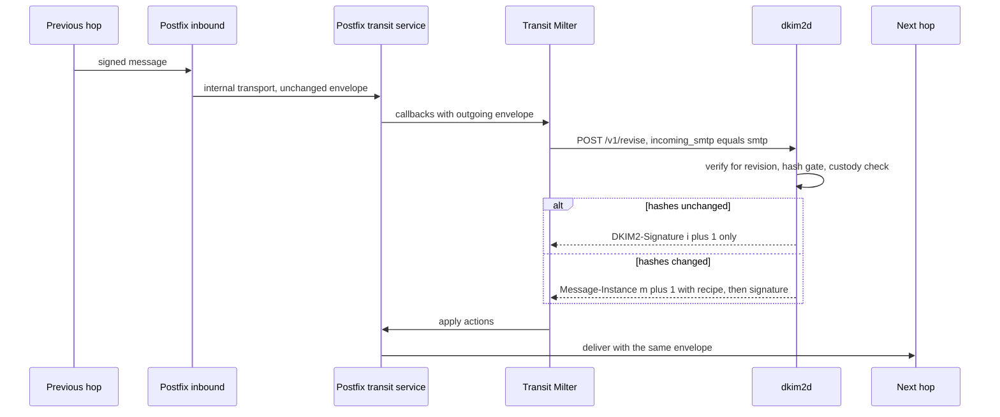
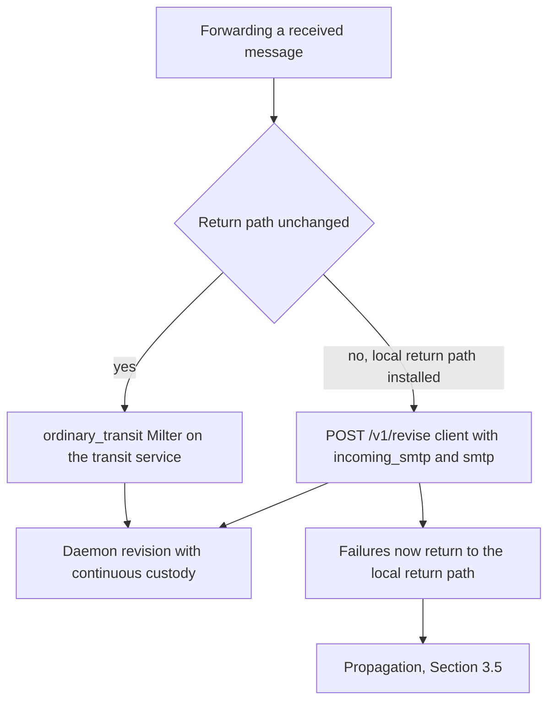
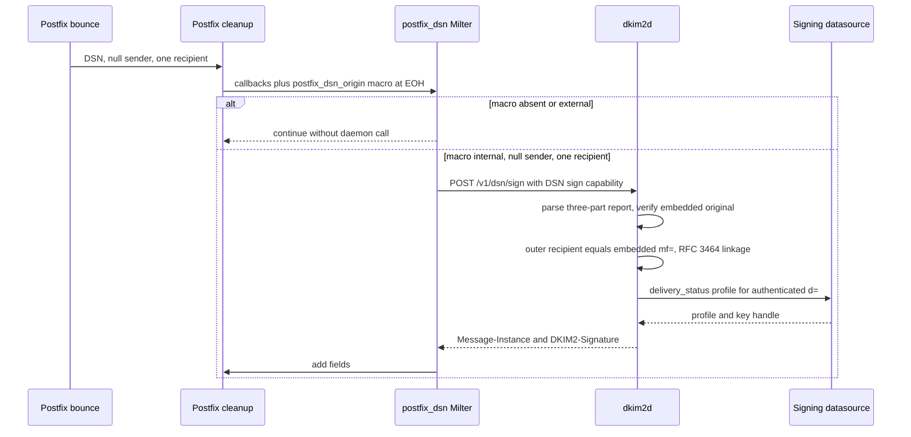
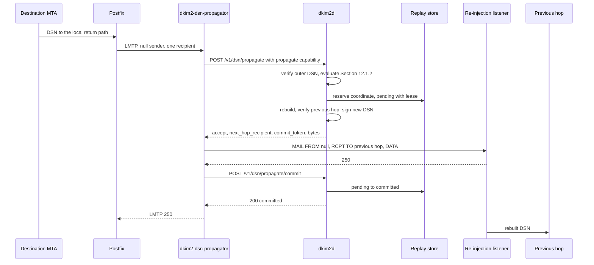
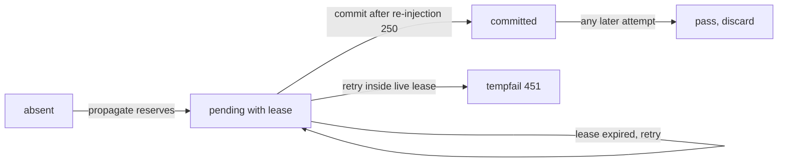
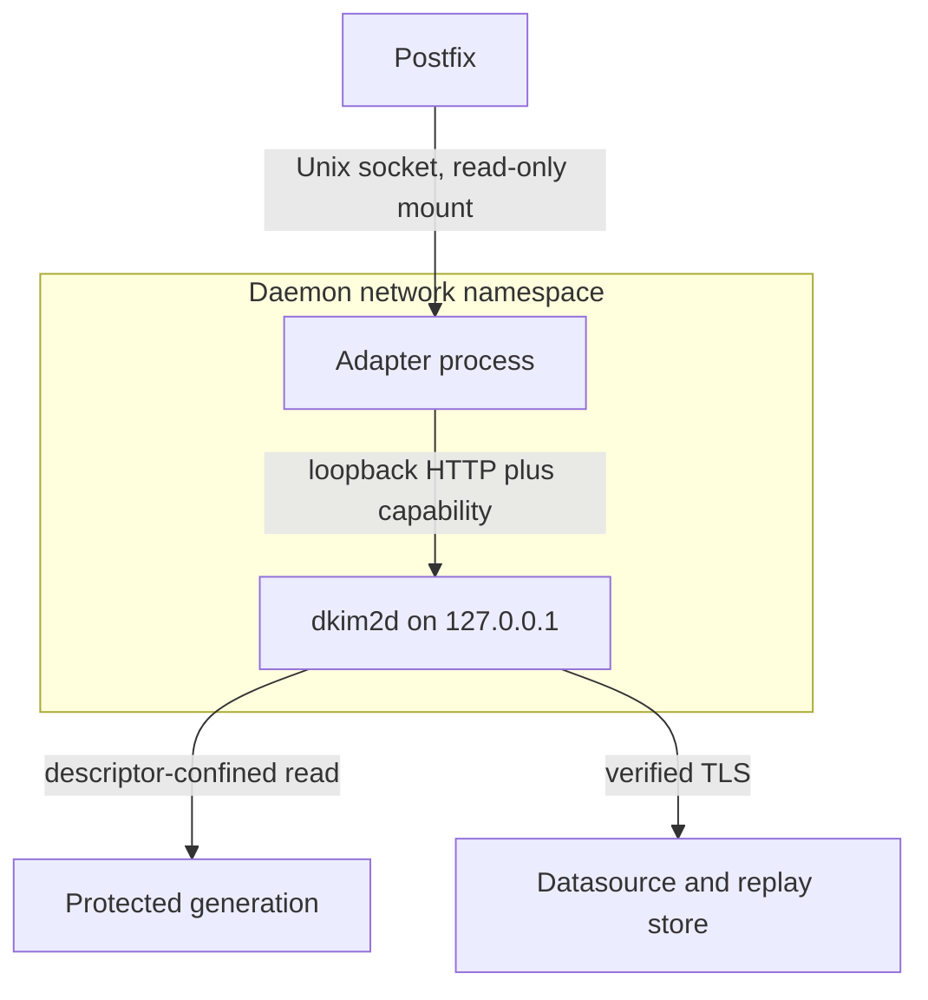

# DKIM2 Deployment Walkthrough

This page is the conceptual map of a DKIM2 deployment built from this
repository: which component runs where, which message takes which path, and
why each boundary exists. It is written for an operator who runs Postfix and
has not seen this project before. It is not the deployment procedure. The
hardened step-by-step procedure, the exact Postfix parameters, the protected
state layout, lifecycle, backup, and rollback are in
[`postfix-compose.md`](postfix-compose.md); this page links there instead of
repeating it.

Protocol behavior is pinned to `draft-ietf-dkim-dkim2-spec-06` with the
tested `draft-chuang-dkim2-dns-04` DNS behavior. Where the draft leaves a
choice to local policy, this page says so. Where this implementation makes a
recorded interpretation, it is named as one. The authoritative HTTP contract
is [`docs/specs/openapi/dkim2d.yaml`](../specs/openapi/dkim2d.yaml), and the
architecture is [`docs/ARCHITECTURE.md`](../ARCHITECTURE.md).

All domains on this page are reserved `.test` identities: `example.test` is
the deployment's own domain, `mx.example.test` its MTA, `origin.test` the
system that sent a message to it, and `destination.test` the system it
forwards to. Nothing here names a real host, address, or operator.

## 1. What DKIM2 changes

DKIM2 signs a message at every hop, not only at the origin. Each system that
handles the message adds its own `DKIM2-Signature` with a sequence number
`i=`, and the sequence forms a chain of custody (Draft-06 Sections 8 and 9.2).
Three properties of that chain matter for a deployment:

- **The signature binds the SMTP envelope.** A signature records the `MAIL
  FROM` used to send the message in `mf=` and the `RCPT TO` values in `rt=`
  (Sections 8.5 and 8.6). A verifier checks the highest signature's `mf=` and
  `rt=` exactly against the envelope it observes (Section 11.4), checks that
  each signature's `d=` relaxed-matches its own `mf=` domain, and checks that
  every `mf=` after the first matches an `rt=` of the previous signature
  (Section 9.4). A message that arrives with an envelope the last signer did
  not record does not verify.
- **The message state is documented in a Message-Instance.** Every message
  carries a `Message-Instance` field with a revision number `m=`, the header
  and body hashes of that revision, and, for `m>1`, a Recipe `r=` that
  recreates the previous revision (Sections 5 and 7). A forwarder that changes
  the message becomes a Reviser: it adds a new instance whose Recipe lets the
  verifier undo the change and validate the earlier signatures over the
  earlier state (Sections 9.1 and 11). A forwarder that changes nothing may
  add only a signature, or, if the envelope is unchanged too, nothing at all.
- **Bounces stay inside the chain.** A delivery-status notification is
  addressed to the `mf=` of the highest signature, never to an address taken
  from the message, and is not sent at all when that `mf=` is null
  (Section 12). A forwarder that receives such a notification may rebuild it
  for its own previous hop (Section 12.1.1), and a receiver can authenticate a
  notification against the signatures of the embedded original
  (Section 12.1.2).

What that buys an operator, in the draft's own terms: forwarding survives
because changes are documented rather than destructive; a replayed message is
distinguishable from one that was intended for the address it arrives at,
because the envelope is signed and the `exploded` flag reports a legitimate
fan-out (Sections 1 and 8.10); and bounces are authenticated and passed back
along the chain instead of becoming backscatter (Section 12). Replay
*detection*, the decision to refuse a second copy, is local security policy
in this implementation, not protocol verification; see
[`docs/conformance.md`](../conformance.md).

## 2. The component map

Exactly one process knows the protocol and touches keys: `dkim2d`. Everything
else is an adapter that collects MTA evidence, calls one daemon route with one
route-specific capability, and applies only the returned action plan.

| Component | Role | May hold | Never holds |
| --- | --- | --- | --- |
| `dkim2d` | Verification, policy, replay coordination, signing, revision, delivery-status signing and propagation; the only protocol implementation and the only key consumer | Every route capability it serves, the protected generation, datasource credentials, private-key material or handles, replay HMAC | Milter or Exim action application, public HTTP exposure |
| `dkim2-milter` in mode `inbound` | Milter-v6 adapter on `smtpd_milters`; calls `POST /v1/process`; scrubs and adds `Authentication-Results` | The process capability | Any signing capability, keys, datasource records |
| `dkim2-milter` in mode `originator` | Milter on `non_smtpd_milters`; calls `POST /v1/sign` for locally submitted mail; tempfails every null sender before daemon I/O | The sign capability | Keys, key handles, the DSN capabilities |
| `dkim2-milter` in mode `ordinary_transit` | Milter on a dedicated transit service; calls `POST /v1/revise` for unchanged-envelope forwarding | The revise capability | Keys, the other capabilities |
| `dkim2-milter` in mode `postfix_dsn` | Milter on `non_smtpd_milters` for locally generated bounces; calls `POST /v1/dsn/sign` only after the exact `{postfix_dsn_origin}=internal` macro | The DSN signing capability | Any other capability; it must not be shared with any other adapter or client |
| `dkim2-dsn-propagator` | MTA-neutral LMTP adapter; calls `POST /v1/dsn/propagate` and `/commit`, re-injects the rebuilt notification | The propagation capability | The process, sign, revise, or DSN signing capability |
| Rspamd module (`contrib/rspamd`) | Alternative inbound consumer of `POST /v1/process` from inside Rspamd | The process capability | Any signing capability; it cannot sign bounces because Rspamd does not expose the origin macro |
| `dkim2-exim` | Source-linked Exim `local_scan()` inbound service plus one-shot originator and ordinary-transit transport filters; capability `unqualified_draft06` | The capability of its configured operation | Draft-06 qualification evidence |
| `dkim2ctl` | Generated-client smoke and fixture runner for a test deployment | Whichever route capabilities the operator hands it for that test | Operator mutation commands |
| Signing datasource | Flat-file, LDAP, PostgreSQL, MySQL, or MariaDB source of signing profiles, policies, and native keys | Immutable committed generations | A signing capability of its own |
| Replay store | Valkey, process-local memory, or explicitly disabled; first-seen coordinates and propagation coordinates | Privacy-preserving HMAC-derived keys | Message content, addresses |

The separation exists so that the compromise of one adapter authorizes only
that adapter's route. A compromised inbound Milter can ask the daemon to
verify; it cannot ask it to sign. A compromised originator Milter can obtain
signatures only for mail the daemon's own datasource policy admits for that
tenant and domain, over the envelope the Milter observed, and never sees a
key. The DSN signing capability is an attestation of Postfix origin, which is
why it is confined to one adapter mode. Reference pages:
[`cmd/dkim2d/README.md`](../../cmd/dkim2d/README.md),
[`cmd/dkim2-milter/README.md`](../../cmd/dkim2-milter/README.md),
[`cmd/dkim2-dsn-propagator/README.md`](../../cmd/dkim2-dsn-propagator/README.md),
[`cmd/dkim2ctl/README.md`](../../cmd/dkim2ctl/README.md),
[`contrib/rspamd/README.md`](../../contrib/rspamd/README.md), and
[`docs/operations/exim-adapter.md`](../operations/exim-adapter.md).

## 3. Signal flows

### 3.1 Inbound verification

A message from `origin.test` arrives at `mx.example.test`. The inbound Milter
reconstructs the message from Milter callbacks and sends it, with the exact
envelope, to `POST /v1/process`.

1. The peer completes the SMTP transaction up to end of data. Postfix has
   already prepended its own `Received` field outside the bytes a Milter sees;
   that is a documented adapter limitation, not a fidelity claim
   ([`docs/conformance.md`](../conformance.md)).
2. The adapter reconstructs an RFC 5322 representation declared as
   `milter_reconstructed_crlf`, preserving header order, casing, duplicates,
   and body bytes, and the ordered envelope including duplicate recipients.
   It sends exactly one request at end of message, authenticated by the
   process capability.
3. If the message carries neither `Message-Instance` nor `DKIM2-Signature`,
   the daemon answers `204`: no DNS, policy, or replay work happens and the
   Milter continues without a DKIM2 result. There is no domain-wide
   participation probe, because the selector and domain needed for a key
   lookup come only from a present signature.
4. Otherwise the daemon runs the verification order of
   [`docs/ARCHITECTURE.md`](../ARCHITECTURE.md) Section 10: field validation,
   instance and sequence numbering, the highest signature against the observed
   envelope, timestamps, DNS key fetch, signature and hash verification,
   Recipe application to reconstruct earlier instances, chain of custody, and
   flags. DNS timeouts are `TEMPERROR`; an absent, multiple, malformed, or
   revoked key record is `PERMERROR` (Section 11.5). Lookups are cached for
   the shorter of the DNS TTL and a configured cap.
5. The verification state is one of `PASS`, `FAIL`, `PERMERROR`, or
   `TEMPERROR` (Section 11.1). The daemon then applies the replay gate and the
   configured policy mode. Replay is a stored first-seen coordinate derived
   from the message's own signed identity through a keyed HMAC; the result
   classes are `not_checked`, `disabled`, `first_seen`, `exploded`,
   `replayed`, and `indeterminate`.
6. The response carries a disposition of `accept`, `reject`, `tempfail`, or
   non-terminal `continue`, and at most one action: the daemon-owned
   `Authentication-Results` value `<authserv-id>; dkim2=<pass|fail|permerror|temperror>`.
   The adapter first removes every pre-existing field claiming the configured
   `authserv-id`, as RFC 8601 requires at a trust boundary, then inserts the
   daemon's field. It never synthesizes a result of its own.
7. `reject` becomes `550 5.7.1 DKIM2 policy rejection`; `tempfail`, daemon
   unavailability, a malformed response, or an unprovable reconstruction
   becomes `451 4.7.1 DKIM2 service unavailable`. `failure.mode: fail_open`
   exists as a visible compatibility setting and never overrides an explicit
   daemon refusal.

The policy modes are local policy, not draft text. `strict` accepts `PASS`,
rejects `FAIL` and `PERMERROR`, and defers `TEMPERROR`; `permissive` accepts
`FAIL` and `PERMERROR` for rollout compatibility; `testing` returns
`continue` for every coherent state so results can be reported without
controlling delivery. The state itself is identical in all three modes.

The Rspamd module is the same flow with a different transport: an Rspamd
normal filter sends the unchanged message buffer and the original SMTP paths
to `POST /v1/process` with the same process capability, publishes zero-score
symbols for the daemon's closed result classes, and maps `reject` and
`tempfail` to Rspamd pre-results. It supports the loopback transport or the
daemon's TLS private-network listener. It verifies received notifications with
a null sender like any other message, but it cannot replace the `postfix_dsn`
Milter for signing locally generated bounces, because Rspamd does not request
or expose the origin macro. See
[`contrib/rspamd/OPERATIONS.md`](../../contrib/rspamd/OPERATIONS.md).

### 3.2 Originator signing on submission

A user of `example.test` submits a message. Postfix `cleanup(8)` runs the
`non_smtpd_milters` chain, which is where the originator Milter sits, so the
message is signed before it enters the queue and before any delivery attempt.

1. Postfix simulates Milter callbacks for non-SMTP submission with
   unbracketed mailboxes; the adapter validates them under the full RFC 5321
   grammar and adds only the missing outer angle brackets.
2. A null reverse path is tempfailed before any daemon I/O. A null sender is
   never authority for signing on this route; bounces have their own path
   (Section 3.4).
3. The adapter accepts exactly one recipient per transaction in the signing
   modes and fails a second `RCPT TO` closed. The reason is the Bcc rule:
   Draft-06 Section 8.6 permits several `RCPT TO` values in one `rt=`, but
   requires that no Bcc recipient be revealed to any other recipient. Milter
   callbacks cannot prove which recipients were blind, so the library's safe
   default is one `rt=` value per message copy and the Milter's
   `signing.allow_recipient_group` must stay `false`. A submission with
   several recipients must therefore reach the signing route as
   one-recipient transactions; producing that split is MTA configuration and
   is not part of the checked rendering. The Exim adapter documents the
   equivalent `max_rcpt=1`.
4. The request carries the exact message, the exact outgoing envelope, and
   the tenant and signing domain from the Milter's configuration, either a
   static domain or, with `domain_source: envelope_sender`, the validated
   ASCII reverse-path domain. It carries no selector, key, profile, or
   algorithm; the daemon resolves those.
5. The daemon looks up the exact tenant and domain `originator` profile and
   policy in its signing datasource. An authoritative absent or inactive
   profile answers `204`: signing is not applicable and the message continues
   unsigned. An unavailable or ambiguous datasource is temporary; a malformed
   active configuration is permanent. `204` is never an availability
   fallback.
6. The daemon computes the body and header hashes, adds `Message-Instance:
   m=1` with no Recipe, builds `DKIM2-Signature: i=1` with the observed
   `mf=` and `rt=`, the daemon-owned `donotmodify` and `donotexplode` flags
   from its policy, signs through an opaque key handle, and verifies its own
   output before answering. The private key never leaves the daemon.
7. The Milter applies the ordered action plan, `Message-Instance` then
   `DKIM2-Signature`, and Postfix queues the message with the envelope the
   Milter observed, so the onward SMTP transaction carries the signed `mf=`
   and `rt=` exactly.

An address literal or a non-ASCII reverse path is not applicable on this route
and continues unchanged, because the signed-envelope grammar of this
implementation is ASCII-only.

### 3.3 Ordinary transit revision

`mx.example.test` receives a message for a local address that forwards to
`destination.test`. Two things must happen: the forwarded copy needs a new
signature from `example.test`, and any change the forwarder made must be
documented in a Recipe.

1. The message enters through the inbound path of Section 3.1 and is then
   routed by an explicitly classified internal transport to a Postfix SMTP
   service that carries only the transit Milter. In the checked rendering
   that service listens on the Postfix container's loopback and is not
   reachable from anywhere else.
2. **Where the next-hop envelope comes from.** The transit Milter observes
   exactly one SMTP transaction, the one Postfix opens toward the transit
   service. That envelope is the one Postfix will use toward
   `destination.test`, so the Milter sends it as both the inherited envelope
   `incoming_smtp` and the outgoing envelope `smtp` of `POST /v1/revise`.
   This is why the mode is called ordinary transit: it is correct only when
   the return path is unchanged.
3. The daemon first verifies the message for revision against the inherited
   envelope. A bare `PASS` is not revision authority; signing uses only the
   sealed verified input that call returns.
4. The hash gate decides the shape of the revision (Section 9.1 of the draft,
   made deterministic by local policy): if the current header and body
   hashes equal the highest instance, no new `Message-Instance` is added and
   only `DKIM2-Signature: i+1` is emitted; if either differs, exactly one
   `Message-Instance: m+1` is added whose Recipe recreates the previous state,
   followed by the signature. Generated Recipes are conservative, not
   minimal, and are proven by applying them before use.
5. Custody must be continuous: the new signature's `mf=` domain must
   relaxed-match an `rt=` domain of the previous signature, and its `d=` must
   align with its own `mf=` domain (Sections 9.4 and 11.4). Unrelated domains
   are a permanent policy rejection, not a configuration to bypass.
6. If the forwarder installed its own local return path, which is exactly the
   premise of delivery-status propagation, the outgoing `MAIL FROM` differs
   from the inherited one. The transit Milter cannot present both, so the
   daemon rejects the revision as a custody discontinuity. Such mail must be
   revised through a `POST /v1/revise` client that supplies the inherited
   envelope as `incoming_smtp` and the forwarding envelope as `smtp`, as the
   propagation qualification lane does; the Milter mode is deliberately not
   extended, because no Milter callback can attest the inherited envelope
   ([`docs/reference/known-limitations.md`](../reference/known-limitations.md)).

A next-domain transition with `nd=` (Section 9.3) is a library capability with
its own out-of-band authorization and has no Milter mode; see
[`signing-and-revision.md`](../specs/implementation/signing-and-revision.md).

### 3.4 Signing a locally generated bounce

Postfix `bounce(8)` generates a notification for a message `example.test`
could not deliver. Draft-06 Section 12.1 requires that notification to carry
its own `Message-Instance` and `DKIM2-Signature`, signed with a null `mf=`.
The difficulty is authority: a null sender is trivial to forge, so something
must prove that this MTA, and not an SMTP client, generated the message.

1. The provenance fact is the Milter macro `{postfix_dsn_origin}`, a closed
   enum with the values `internal` and `external` that only `bounce(8)` can
   set to `internal`. It requires a bounce-only Postfix patch; this is a
   local adapter contract, not a DKIM2 wire extension
   ([`postfix-dsn-origin.md`](../specs/implementation/postfix-dsn-origin.md)).
2. The `postfix_dsn` Milter requests that macro for end of headers through the
   standard symbol-list negotiation. Only the exact value `internal`,
   confirmed at that stage, for a transaction with reverse path `<>` and
   exactly one recipient, authorizes a daemon call. `external` or an absent
   macro continues without daemon I/O, so the instance can share the normal
   non-SMTP Milter chain with ordinary mail. A malformed, duplicated, or
   wrong-stage macro is a contract failure, and nothing on this route can
   fall back to originator signing.
3. **Why a null sender alone is never authority.** The originator Milter
   tempfails every `MAIL FROM <>`; the generic `/v1/sign` and `/v1/revise`
   routes reject a null reverse path at the HTTP mapper; and the Rspamd module
   cannot sign bounces at all. The only path to a signed bounce is this
   dedicated mode, and its capability is confined to it: possession of the DSN
   signing capability is the server-side attestation that its sole adapter
   established Postfix origin, which is why it must never be mounted into
   another adapter mode or a diagnostic client.
4. The daemon parses the outer message as an RFC 6522 report with exactly
   three parts, human text, `message/delivery-status`, and either
   `message/rfc822` or `text/rfc822-headers`, under bounded limits, then
   verifies the embedded original's highest signature and instance from exact
   bytes. There is no independently observed original envelope at bounce time,
   so that one comparison is marked not applicable while cryptography, hashes,
   timestamp, custody, `d=`, `mf=`, and `rt=` are still verified. The outer
   recipient must equal the authenticated embedded `mf=` exactly, which is the
   Section 12 addressing rule, and at least one RFC 3464 recipient must link to
   an authenticated `rt=`. The Postfix bounce wire form is admitted only on
   this capability-authenticated route.
5. Only after verification does the daemon derive the signing domain from the
   canonical authenticated highest embedded `d=` and resolve that tenant and
   domain's `delivery_status` profile. The Milter configuration for this mode
   is `domain_source: verified_embedded` with no configured domain, so one
   instance can serve every local domain without trusting the outer envelope
   or a caller-selected domain.
6. The signed notification gets `Message-Instance: m=1` and
   `DKIM2-Signature: i=1` with `mf=<>` and `rt=` equal to the recipient, and
   Postfix delivers it to the previous hop's return path.

[`docs/conformance.md`](../conformance.md) records this mode as partial: the
adapter covers the exact `internal` enum and the dedicated capability, but the
mode still requires the upstream Postfix patch and its qualification harness.

### 3.5 Received notifications and propagation

The reverse direction: `example.test` forwarded a message from `origin.test`
to `destination.test` with its own local return path, and `destination.test`
could not deliver it. Its notification comes back to the local return path.
Draft-06 Section 12.1.2 says the receiver should authenticate it, and
Section 12.1.1 says a forwarder may rebuild it for the previous hop, with the
forwarder's own signatures and modifications removed.

Two daemon surfaces cover this. `POST /v1/process` evaluates every received
notification read-only and adds a closed `delivery_status` projection, so the
inbound path of Section 3.1 already answers whether a notification is
structurally valid, whether its embedded original verifies, whether the hop it
reports on was ours, and whether propagation would be possible. That
projection can never authorize signing. Propagation is a separate route,
`POST /v1/dsn/propagate` with `POST /v1/dsn/propagate/commit`, behind the
fifth capability and behind the replay store.

1. **The reserved return-path class.** Forwarded mail must already leave
   `example.test` with a local `mf=` whose domain is a local authority
   domain; automatic sender rewriting is out of scope. The MTA routes mail for
   exactly those addresses, and only those, to the adapter's LMTP socket with
   one recipient per transaction and without any address rewriting, because
   the daemon compares the recipient byte-wise against the signed `mf=` apart
   from domain case. Three workable shapes are one reserved local part, one
   reserved subdomain such as `returns.example.test`, or an anchored
   regular-expression table over a variable return-path prefix; the tradeoffs
   and the exact Postfix parameters are in
   [`postfix-compose.md`](postfix-compose.md#delivery-status-propagation).
2. **The LMTP adapter.** `dkim2-dsn-propagator` is not a Milter. It accepts
   exactly one transaction with `MAIL FROM:<>` and one `RCPT TO`, refuses a
   non-null sender with `550` because the class is reserved for
   notifications, refuses a second recipient with `452`, and sends the bytes
   as `lmtp_delivered_crlf` fidelity together with the observed envelope, the
   tenant, and its configured `Reporting-MTA` name.
3. The daemon verifies the outer notification as an ordinary message first,
   then evaluates it: three-part structure; embedded verification; local hop
   identity, meaning the completion signature's `d=` is a domain for which the
   tenant holds an active signing profile, with the timestamp window evaluated
   at the outer notification's `t=`; outer signer alignment with the
   completion signature's `rt=`; RFC 3464 recipient linkage; and an
   `Action: failed` group. "Local" is datasource authority over a signing
   domain, never an address in `mf=`. The alignment reading, the
   timestamp reference, and the run-member verification are recorded local
   interpretations
   ([`delivery-status-propagation.md`](../specs/implementation/delivery-status-propagation.md)).
4. **Two-phase replay commit, phase one.** The daemon derives a propagation
   coordinate from the outer notification's own signature and instance, in a
   domain-separated frame so an inbound `/v1/process` pass on the same
   notification does not look like a replay, and reserves it as `pending`
   with a lease. A live lease answers `tempfail`; an expired lease is
   re-served with a fresh rebuild; a committed coordinate answers `discard`.
   This gate is the only bound on how many signed notifications one captured
   DSN can extract, which is why the route refuses to exist over
   `replay.backend: disabled`.
5. The rebuild descends the local hop run through the existing Recipe
   applier, verifies the previous hop's signature over the reconstructed state
   before its `mf=` may become a recipient, removes exactly the run's
   signatures and instances plus the hash-excluded fields above the previous
   hop, degrades to `text/rfc822-headers` when the body cannot be
   reconstructed, regenerates the machine and human parts from closed
   templates without destination-specific data, and signs a new
   single-instance, single-signature notification with `mf=<>` addressed to
   the previous hop's `mf=`. The signing domain is the canonical `d=` of the
   removed completion signature, resolved to that domain's `delivery_status`
   profile; a forwarding domain without that profile is a permanent
   `unprovisioned_domain` refusal with disposition `discard`.
6. **The Milter-free re-injection listener.** On `accept`, the adapter opens
   one SMTP session to a trusted loopback listener that carries no Milters,
   no `non_smtpd_milters`, no content filter, no address mappings, and admits
   only `mynetworks`. The rebuilt notification is already signed by the
   propagation route; any signer or filter on this path would alter or
   re-sign it. The listener must advertise `SMTPUTF8` or `8BITMIME` when the
   response requires them; the adapter defers rather than downgrades.
7. **Phase two.** After the listener's `250`, the adapter calls the commit
   route with the `commit_token`, and only after the commit's `200` does it
   answer the LMTP transaction with `250`. Nothing is acknowledged earlier, so
   a failed re-injection is retried by Postfix, never silently dropped.

Propagation is at-least-once. A duplicate can reach the previous hop in three
windows: a crash between the listener's `250` and the commit; a lease that
expired while an attempt was still running; and a commit token the daemon can
no longer resolve after a restart, which is answered `409`, deferred as `451`,
and re-served once the lease expires. Keeping the MTA's minimum retry interval
above `dsn_propagation.pending_lease` is what stops that last window from
wasting attempts. The outcomes `terminal_origin` (we originated it),
`not_failure`, `forbidden_null_previous_sender`, `unsupported_chain`, and
`not_reconstructable` are `discard`, each counted under its own class; a
verification failure or a notification that is not ours is `reject`, which the
adapter answers `550` or, under its single policy knob
`permanent_failure_reply: discard`, `250`.

## 4. Capabilities and trust boundaries

### Five route capabilities

Every daemon route that does work is authenticated by a 32-byte protected
capability file that belongs to the daemon's current protected generation.
At v0.1.27 there are five, and they must all be distinct:

| Capability | Configuration path | Header | Routes | Holder |
| --- | --- | --- | --- | --- |
| process | `server.capability_file` | `X-DKIM2-Capability` | `/v1/process` | inbound Milter, Rspamd module, `dkim2ctl` |
| sign | `server.sign_capability_file` | `X-DKIM2-Capability` | `/v1/sign` | originator Milter |
| revise | `server.revise_capability_file` | `X-DKIM2-Capability` | `/v1/revise` | transit Milter or a two-envelope revise client |
| DSN sign | `server.dsn_sign_capability_file` | `X-DKIM2-DSN-Sign-Capability` | `/v1/dsn/sign` | `postfix_dsn` Milter only |
| DSN propagate | `server.dsn_propagate_capability_file` | `X-DKIM2-DSN-Propagate-Capability` | `/v1/dsn/propagate`, `/v1/dsn/propagate/commit` | `dkim2-dsn-propagator` only |

A missing, malformed, duplicated, cross-route, or mismatching value receives
the same closed `403` before any body, DNS, policy, replay, or signing work.
`/healthz`, `/readyz`, and `/metrics` take no capability. Capability bytes
never appear in command lines, environment values, logs, or configuration
values; only protected absolute paths do.

### The listener rule

The daemon listens either on one canonical loopback literal, plaintext
HTTP/1.1 with `Connection: close` on every response, or in
`tls_private_network` mode on one private unicast address with TLS 1.3, a
certificate carrying exactly one DNS SAN, and an internal CA. There is no
plaintext private-network mode, no reverse proxy, no port publication, and no
Unix socket. The Milter and the propagator accept only literal-loopback daemon
endpoints; in the checked rendering each adapter therefore joins its own
daemon's container network namespace and Postfix reaches the adapter only
through a read-only Unix-socket mount. The Rspamd module may use either
transport.

### Protected state

The daemon's secrets live in one immutable protected generation: an absolute
directory whose name is the 32-character lowercase hexadecimal
`protected.generation` value, mode `0500`, owned by the daemon UID, containing
every selected capability, replay HMAC, credential, CA, datasource, manifest,
and PKCS#8 file as a direct child with one link and mode `0400` or `0600`. The
YAML file that selects the generation lives outside it. A rotation creates a
new complete generation and restarts the daemon; there is no hot reload and
no in-place repair. The Milter and the propagator hold only their capability
and configuration under the same file contract, with a `0500` parent for the
capability. Postfix holds nothing: it sees three read-only socket directories,
its queue, and its own configuration. The layout, ownership, and validation
commands are in
[`postfix-compose.md`](postfix-compose.md#host-and-protected-state-prerequisites)
and [`cmd/dkim2d/README.md`](../../cmd/dkim2d/README.md#protected-generation).

### The datasource-consumer matrix

A configured `signing.backend` must have at least one consumer; a datasource
that nothing consumes is refused rather than loaded as a silent no-op. v0.1.27
admits exactly three shapes:

| Shape | Route capabilities | `process.default_tenant` | Datasource use | Signing routes |
| --- | --- | --- | --- | --- |
| Verification with locality | none | required | read-only, to classify a received notification as local or foreign | none; `/v1/sign`, `/v1/revise`, `/v1/dsn/sign`, `/v1/dsn/propagate` answer `403` |
| Propagation only | `dsn_propagate_capability_file` | optional | read plus `delivery_status` signing | the two propagation routes |
| Full signing | any of sign, revise, DSN sign, DSN propagate | optional | read plus signing | the configured routes only |

The first shape is the right one for an internet-facing inbound daemon:
locality is a datasource read keyed by `process.default_tenant`, it never
reaches a private key, and the daemon constructs no signer. Do not add an
unused signing capability to make the datasource acceptable. Whenever a
backend is configured, it is a readiness dependency, and a later outage is
reported as `local_hop: temperror`, never as `not_local`. Backend setup is in
[`datasource-backends.md`](datasource-backends.md); the replay store contract
is in [`docs/replay-store-valkey.md`](../replay-store-valkey.md).

## 5. What a visitor should take away

**Protocol-mandated.** The envelope binding in `mf=` and `rt=`, the exact and
relaxed custody checks, Message-Instance numbering and Recipes, the four
verification states, the 14-day timestamp rule, the addressing of a
notification to the highest `mf=`, the three-part notification structure, the
propagation rebuild that removes the forwarder's fields and degrades to
headers-only, and the single-instance, single-signature shape of a propagated
notification all come from Draft-06.

**Recorded interpretation or local policy.** The policy modes; replay
detection and the propagation coordinate; single-recipient signing; the
deterministic no-new-instance rule when hashes are unchanged; the received
notification policy table; the directed relaxed-match reading of "aligned";
the timestamp reference for the completion signature; the removal of
hash-excluded fields above the previous hop; custody validation below the
previous hop; and the refusal to reconstruct an `nd=` previous hop. Each is
named as such in the implementation specifications and in
[`docs/reference/draft-issues.md`](../reference/draft-issues.md).

**One operator's composition.** Three daemon and Milter pairs for inbound,
originator, and transit; a loopback transit SMTP service; a reserved
return-path class; a loopback re-injection listener; a retry interval above the
lease; and container namespaces are the checked Postfix rendering. Another
MTA satisfies the same contract when it can select the return-path class
without rewriting, offer a null-sender submission endpoint with no signing
attached, defer on `4xx`, and leave bytes unchanged; this project makes no
qualification claim for any MTA other than Postfix.

**Where the limits are.**

- A Milter-reconstructed message is `milter_reconstructed_crlf` evidence,
  not raw wire bytes; Postfix's own `Received` field is outside it. The
  Postfix and Milter qualification is the implemented adapter path.
- Exim is `unqualified_draft06`: the adapter is implemented, but its five-row
  evidence is historical Draft-04 evidence and does not qualify the Draft-06
  candidate.
- `postfix_dsn` is partial until the upstream Postfix patch and qualification
  harness exist.
- The `ordinary_transit` Milter cannot sign a forwarder that rewrites its
  return path; that mail needs a two-envelope `POST /v1/revise` client.
- Propagation refuses `unsupported_chain` for an `nd=` previous hop or a
  non-verifying run member, cannot complete when the previous hop's key was
  rotated away, cannot reach an EAI previous hop, is at-least-once, is
  one-to-one with the notifications a destination sends, and costs one extra
  pass for an own imaginary hop below an own `nd=` chain.
- Replay identity is a drain-only epoch: Draft-04 and Draft-06 traffic never
  overlap, and the detection gap is bounded by the retention period.

The complete list, with stable identifiers, is
[`docs/reference/known-limitations.md`](../reference/known-limitations.md).
